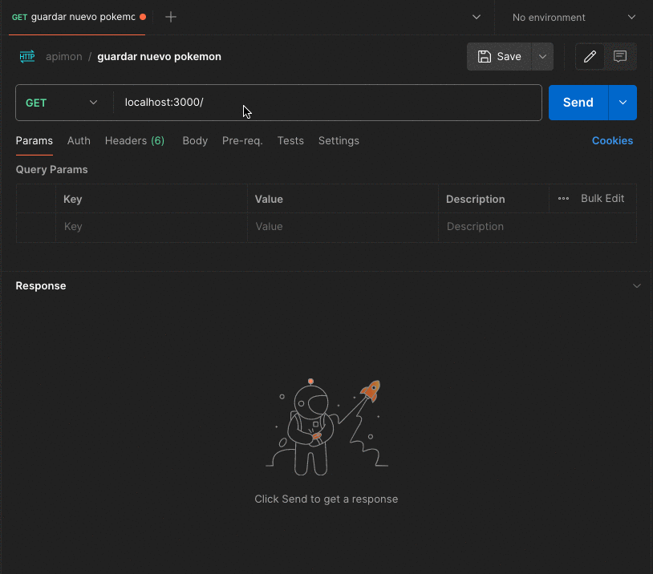
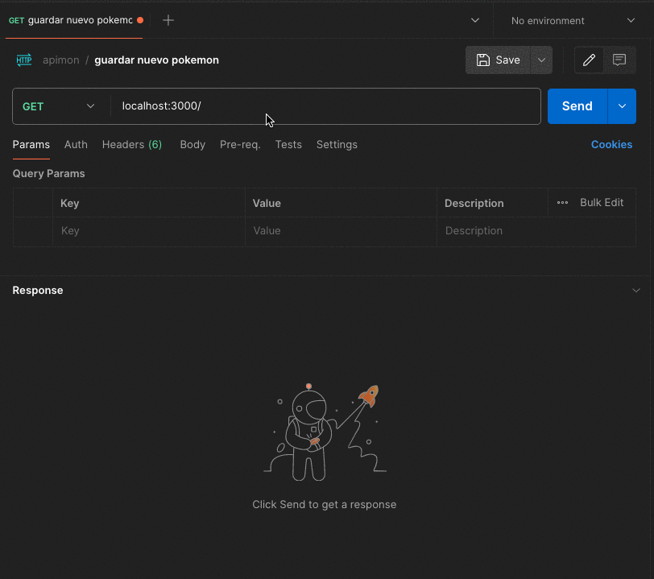
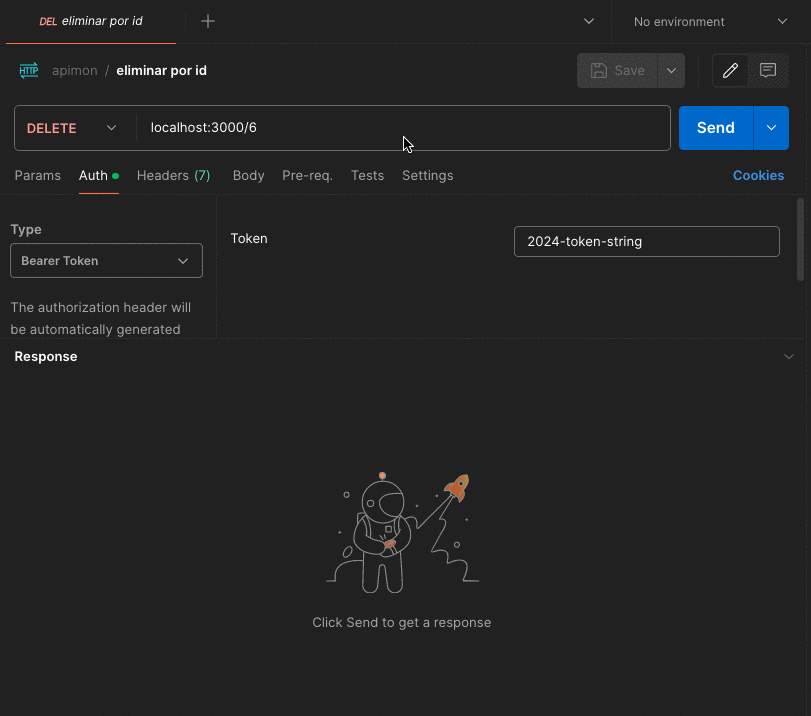
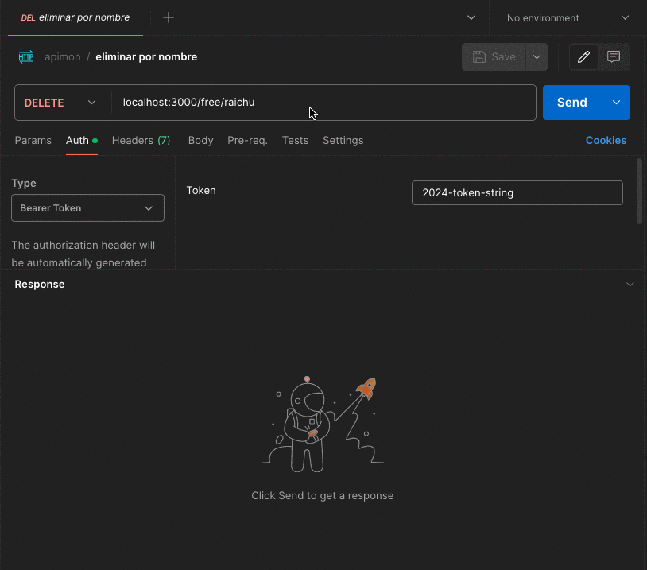

# APImon  

La aplicación APImon desarrollada en Node.js tiene como objetivo principal interactuar con la API de Pokémon, específicamente la PokeAPI, para proporcionar una herramienta útil que permita a los usuarios gestionar datos detallados sobre Pokémon de manera eficiente.

Esta API actúa como una especie de Pokédex digital, ofreciendo funcionalidades clave para los aficionados a Pokémon, como la búsqueda, almacenamiento y eliminación de información sobre Pokémon.

Al permitir a los usuarios buscar y almacenar información detallada sobre Pokémon, incluyendo su ID, nombre, tipos y movimientos, nuestra API facilita el acceso rápido y organizado a datos relevantes para la comunidad Pokémon.

## Acerca del Proyecto 💻
El funcionamiento de la aplicación se divide en varios pasos o elementos:

- **Consumo de la API de Pokémon**: La aplicación hace uso de la API de Pokémon (PokeAPI) para obtener datos detallados sobre Pokémon específicos. Esto se logra mediante solicitudes GET a la API, utilizando el nombre del Pokémon como parámetro en la URL.

- **Almacenamiento en la Base de Datos**: Los datos obtenidos de la API, como el ID, nombre, tipos y los primeros movimientos (limitados a los primeros cuatro), se almacenan en una base de datos para su posterior acceso. En este caso se hace uso de una base de datos portable con **SQLite3**, la cual viene anexada dentro del proyecto.

- **Eliminación de Pokémon**: Se proporcionan endpoints REST que aceptan el ID o nombre del Pokémon como parámetro y los eliminan de la base de datos. Tambien se puede hacer una eliminación por bloque usando un endpoin para eliminar por tipo de pokémon Esto permite a los usuarios gestionar su lista de personajes almacenados.

- **Listado de Pokémon**: La aplicación ofrece un endpoint que permite listar todos los Pokémon almacenados en la base de datos. Esto ofrece a los usuarios una visión completa de los Pokémon que tienen guardados.

- **Uso de Consultas**: Para el manejo de las consultas de los pasos anteriores se hace uso de del modulo _**Prisma ORM**_ el cual nos permite ejecutar las queries de una manera mas simple, evitando perder tiempo en la construcción delas sentencias SQL.

## Pre-requisitos 📋

_Asegurate de tener los siguientes requisitos para usar el proyecto:_

- **Node.js y npm:** Asegúrate de tener Node.js instalado en tu sistema (se utiliza la versión 20.11.1). **Node.js** es un entorno de tiempo de ejecución de JavaScript que te permite ejecutar código JavaScript fuera de un navegador web. **NPM (Node Package Manager)** se instala automáticamente junto con Node.js y te permite gestionar las dependencias de tu proyecto (se emplea la versión 10.5.0).

  Puedes descargar e instalar Node.js desde el sitio web oficial: [Node.js](https://nodejs.org/).

- **Git:** Git es un sistema de control de versiones distribuido que te ayudará a clonar y gestionar tu código fuente desde un repositorio remoto. Asegúrate de tener Git instalado en tu sistema.

  Puedes descargar e instalar Git desde el sitio web oficial: [Git](https://git-scm.com/).

## Instalación 🔧

Para comenzar a utilizar este proyecto, sigue estos pasos:

1. **Clonar el repositorio:**
   Para obtener una copia del proyecto en tu máquina local, puedes clonar el repositorio desde GitHub. Abre tu terminal y ejecuta el siguiente comando:

   ```bash
   git clone https://github.com/marioneta009/apimon.git
   ```

2. **Entrar al proyecto:**
   Una vez que hayas clonado el repositorio, navega al directorio del proyecto usando el comando cd (_Asegúrate de estar en la raíz del proyecto antes de continuar con los siguientes pasos_).

   ```bash
   cd apimon
   ``````

3. **Instalar dependencias:**
   Antes de ejecutar la aplicación, necesitarás instalar las dependencias del proyecto. Utiliza npm (Node Package Manager) para instalar las dependencias especificadas en el archivo **_package.json_**.

   **Dependencias**:
   - @prisma/client: Prisma es un ORM (Object-Relational Mapping) para bases de datos SQL y NoSQL. @prisma/client es la biblioteca cliente de Prisma que proporciona una API para interactuar con la base de datos y realizar operaciones CRUD de forma sencilla y segura.
   - axios: Axios es un cliente HTTP basado en promesas para el navegador y Node.js. Se utiliza para realizar solicitudes HTTP a servidores remotos y procesar las respuestas de forma asíncrona.
   - express: Express es un marco de aplicación web para Node.js que facilita la creación de servidores web y APIs. Proporciona una amplia gama de características para manejar rutas, solicitudes HTTP, respuestas, middleware, entre otros.
   - node-cache: node-cache es un módulo de caché simple y liviano para Node.js. Se utiliza para almacenar en caché datos en la memoria del servidor para mejorar el rendimiento y reducir la carga en la base de datos u otros servicios externos.

   **Dependencias de Desarrollo**:
   - artillery: Artillery es una herramienta de pruebas de carga y estrés para aplicaciones y servicios web. Permite simular miles de usuarios concurrentes realizando solicitudes HTTP a una aplicación para evaluar su rendimiento y detectar posibles cuellos de botella.
   - chai: Chai es una biblioteca de aserciones para Node.js y el navegador que se utiliza junto con frameworks de pruebas como Mocha o Jasmine. Proporciona una sintaxis expresiva y fácil de usar para escribir y ejecutar pruebas unitarias y de integración.
   - mocha: Mocha es un marco de pruebas para Node.js que se utiliza para escribir y ejecutar pruebas unitarias y de integración. Es altamente configurable y compatible con diversas bibliotecas de aserciones como Chai y Should.
   - nodemon: Nodemon es una herramienta de desarrollo que se utiliza para reiniciar automáticamente la aplicación Node.js cuando se detectan cambios en los archivos del proyecto. Facilita el proceso de desarrollo al eliminar la necesidad de reiniciar manualmente el servidor después de cada cambio en el código.
   - prisma: Prisma es un ORM (Object-Relational Mapping) para bases de datos SQL y NoSQL. En el contexto de las dependencias de desarrollo, prisma se utiliza para ejecutar y gestionar migraciones de base de datos, así como para realizar otras tareas de desarrollo relacionadas con la base de datos.
   - supertest: Supertest es una biblioteca de pruebas para Node.js que se utiliza para realizar solicitudes HTTP a una aplicación Express y realizar aserciones sobre las respuestas. Es especialmente útil para probar APIs RESTful y aplicaciones web basadas en Express.

   Usando el siguiente comando se descargará e instalará todas las dependencias necesarias que se requieren para ejecutar la aplicación.

   ```bash
   npm install
   ```
> [!WARNING]
> Es necesario considerar que las dependencias toman aproximadamente 3 minutos en ser cargadas, dependiendo de su conexión a internet, esto debido a la naturaleza de dependencias como _**Artillery**_, la cuál es bastante pesada en custión de tamaño de almacenamiento.

1. **Ejecutar la aplicación Node.js:**
   Una vez que las dependencias se hayan instalado correctamente, puedes ejecutar la aplicación Node.js. Utiliza uno de los dos comandos siguientes para iniciar la aplicación en el puerto 3000.

   ```bash
   #iniciar con un demonio de escucha para reiniciar la aplicación en un entorno de desarrollo
   npm run dev
   
   #iniciar el servidor en modo manual de la aplicación
   npm run start
   ```

Esto iniciará la aplicación Node.js y estará disponible en tu servidor en http://localhost:3000.

Siguiendo estos pasos, podrás descargar el repositorio, instalar las dependencias y ejecutar la aplicación Node.js localmente en tu máquina. ¡Disfruta explorando el proyecto!

## Uso Básico 🔩

> Consumo de la API de Pokémon:

La aplicación hace uso de la API de Pokémon (PokeAPI) para obtener datos detallados sobre Pokémon específicos. Esto se logra mediante solicitudes GET a la API, utilizando el nombre  del Pokémon como parámetro en la URL.

```bash
http://localhost:3000/{nombre}
```
<p align="center">
  
</p>

La aplicación esta preparada para en estas y otras oeraciones del API manejar errores y casos de uso, algunos ejemplos pueden ser cuando el Pokémon ya existe en la base de datos:
<p align="center">
  
</p>

O cuando se intenta insertar un Pokémon no existente en la realidad o dentro de la PokeApi:
<p align="center">
  
</p>

> Listado de Pokémon:

La aplicación ofrece un endpoint que permite listar todos los Pokémon almacenados en la base de datos. Esto ofrece a los usuarios una visión completa de los Pokémon que tienen guardados.

```bash
http://localhost:3000/
```
<p align="center">
  
</p>

> Eliminación de Pokémon:

Se proporcionan endpoints REST que aceptan el ID, nombre o tipo del Pokémon como parámetro y los eliminan de la base de datos. Esto permite a los usuarios gestionar su lista de Pokémon almacenados.
Se debe de tomar en cuenta que los endpoints se crearon tratando de crear una semantica parecida al lenguaje humano:

Eliminando por ID:

```bash
http://localhost:3000/{id}
```
<p align="center">
  
</p>

Eliminando por Nombre:

```bash
http://localhost:3000/free/{nombre}
```
<p align="center">
  
</p>

Eliminando por Tipo:

```bash
http://localhost:3000/type/{tipo}
```
<p align="center">
  
</p>

## Ejecutando las pruebas ⚙️

El sistema cuenta con algunas pruebas para garantizar el funcionamiento de la aplicación, dichas pruebas se encuentran dentro de la carpeta _**test**_ en la raíz del proyecto.

Para realizar las pruebas unitarias, desde tu terminal, estando ubicado en la raíz del proyecto, debes de ejecutar lo siguiente:

```bash
   npm run test
```
Con dicho comando se desplegarar una prueba de inserción de un nuevo pokemon, listado de datos y la eliminación del mismo pokemon
> [!CAUTION]
> La prueba puede fallar al intentar insertar el pokemon de prueba **_Cherrim_** si es que este ya esta insertado dentro de la base de datos; por lo que se pide ignorar este pokemon al explorar la API, igualmente fue seleccionado debido a ser poco reconocido.

Tambien tenemos pruebas de carga, estas se ejecutan de la siguiente manera, permitiendo tener un reporte en pantalla del manejo de peticiones de la API:

Para realizar las pruebas unitarias, desde tu terminal debes de ejecutar lo siguiente:

```bash
   npm run load-test
```

## Docker 📦

El despliegue de la aplicación se puede realizar tambien usando una imagen para un contenedor de docker; razon por la cual se incluye un archivo _**Dockerfile**_ en el cual usando como imágen base una que incluye node en su versión 21, se colocan los pasos adecuados para generar la imagen personalizada.

Si deseas crearla, y asegurandote de tener las herramientas de docker CLI instaladas, ejecuta lo siguiente desde una terminal y dentro de la ubicación raíz del proyecto:

```bash
   docker build -t apimon .

   #puedes cambiar el nombre de apimon, por uno que mejor se dapte a tu gusto, solo recuerdalo para los siguientes pasos
```
Una vez que tienes la imagen creada (puede llevar varios minutos tenerla lista), puedes empezar a ejecutarla de la siguiente manera:

```bash
   docker run -d -p 3000:3000 apimon
```

De esta manera ya tendremos corriendo nuestra aplicación, y podremos usarla desde el navegador o postman, corriendo en el servidor en http://localhost:3000

## Detalles adicionales del Proyecto 🖇️

- **Repositorio en GitHub**:
El código de la aplicación se encuentra disponible en un repositorio público de GitHub, que puede ser accesado de manera online.

- **README Detallado**:
El repositorio incluye un README detallado que proporciona instrucciones claras sobre cómo ejecutar la aplicación, así como detalles sobre las pruebas unitarias, de carga, entre otros aspectos relevantes. Además, se presenta información sobre las dependencias utilizadas y su justificación en el contexto del proyecto.

- **Colección de Postman**:
Se ha proporcionado una colección de Postman que permite ejecutar las APIs expuestas por la aplicación. Esta colección facilita las pruebas manuales y la comprensión de cómo interactuar con la API de manera efectiva. El archivo para importar se encuentra dentro de la carpeta **_postman_** en la raíz del proyecto.

- **Uso de Dependencias**:
Para el desarrollo del proyecto, se han utilizado diversas dependencias que contribuyen al funcionamiento y la eficiencia de la aplicación. Estas incluyen bibliotecas para la interacción con la API de Pokémon, el manejo de la base de datos, así como otras utilidades necesarias para la implementación de funcionalidades específicas. La elección de estas dependencias se sustenta en su adecuación y eficacia para los objetivos del proyecto, como se detalla en el archivo README.

- **Base de Datos**:
Para la gestión de datos de Pokémon, se ha optado por utilizar una base de datos local, en este caso SQLite3. Esta base de datos ofrece una solución ligera y fácil de usar para almacenar y consultar datos de manera eficiente, lo que se consideró adecuado para las necesidades de este proyecto.

- **Arquitectura y Patrones de Diseño**:
La arquitectura de la aplicación sigue el patrón single router, que facilita el manejo de rutas y la escalabilidad del código. Además, se han utilizado patrones de diseño como el patrón de Repositorio (Mediante Prisma ORM) para la gestión de la base de datos y el patrón de Middleware para la gestión de las solicitudes HTTP.

- **Seguridad**:
Se han implementado medidas de seguridad para proteger la API contra posibles amenazas y ataques. Esto incluye la validación de datos de entrada, la gestión adecuada de tokens de autenticación
> [!IMPORTANT]
> Dado la simplicidad del proyecto solo se usa un Bearer Token, el cual se deja por defecto: **_2014-token-string_**

   También se hace uso de cache para aumentar la eficiencia de la aplicación

> [!TIP]
> En el caso del cache se reserva solo 10 segundos de duración para permitir hacer pruebas, en caso de manejarse en un despliegue real se recomienda moodificar este parametro.

- **Documentación Avanzada**:
La documentación de la API se ha elaborado de manera exhaustiva, incluyendo información detallada sobre la arquitectura de la aplicación, decisiones de diseño, así como documentación de código para explicar partes específicas del código que puedan no ser autoexplicativas. Esta documentación se presenta de manera clara y accesible en el archivo README, asegurando que los desarrolladores puedan comprender y colaborar con el proyecto de manera efectiva.

- **Manejo de Errores Avanzado**:
Se ha puesto un énfasis especial en el manejo de errores para garantizar que la aplicación pueda gestionar de manera eficiente los posibles errores en la solicitud a la API y en el procesamiento de la respuesta. Se ha implementado un manejo de errores centralizado y se utilizan códigos de estado HTTP adecuados para comunicar de manera clara y efectiva cualquier problema que pueda surgir durante la ejecución de la aplicación.

- **Pruebas Unitarias**:
El código de la aplicación está acompañado de pruebas unitarias exhaustivas que garantizan su funcionamiento correcto y su calidad. Estas pruebas se ejecutan como parte del proceso de integración continua, asegurando que cualquier cambio en el código no introduzca regresiones o errores inesperados.

- **Código Limpio**:
El código de la aplicación se adhiere a las mejores prácticas de codificación y está estructurado de manera clara y legible. Se han seguido convenciones de nomenclatura consistentes y se han evitado patrones de código antipáticos. Además, se ha hecho un esfuerzo por mantener el código bien comentado y documentado, facilitando su comprensión y mantenimiento por parte de otros desarrolladores.

- **Monitoreo**:
Aunque en la aplicación no se implemento un marco de monitoreo, se recomiendan las siguientes herramientas para este propósito:

  - **Winston**:
Biblioteca de logging versátil y potente para Node.js. Permite registrar mensajes de registro en varios niveles de severidad. Gestiona múltiples transportes (consola, archivos, bases de datos, etc.). Personaliza fácilmente el formato de registro. Compatible con la agregación de registros y se integra fácilmente con herramientas de monitoreo de terceros. Ampliamente utilizado y bien documentado.
  - **Pino**: Alternativa moderna y de alto rendimiento a Winston. Diseñado para ser extremadamente rápido y eficiente en el uso de recursos. Admite múltiples niveles de registro y personalización del formato de registro.Compatible con herramientas de agregación y monitoreo de logs, como Elasticsearch, Logstash y Kibana (ELK stack). Ideal para aplicaciones con altos requisitos de rendimiento y escalabilidad.

## Autor ✒️

_Menciona a todos aquellos que ayudaron a levantar el proyecto desde sus inicios_

* **José Martin Gutiérrez Arriaga** - *Trabajo Inicial y Documentación* - [Github](https://github.com/marioneta009) - [LinkedIn](https://www.linkedin.com/in/josemartingtz)

## Licencia 📄

Este proyecto está bajo la Licencia ISC - mira el archivo [LICENSE.md](docs/LICENSE.md) para detalles

---
⌨️ con ❤️ por [José Martin Gutiérrez Arriaga](https://github.com/marioneta009) 😊